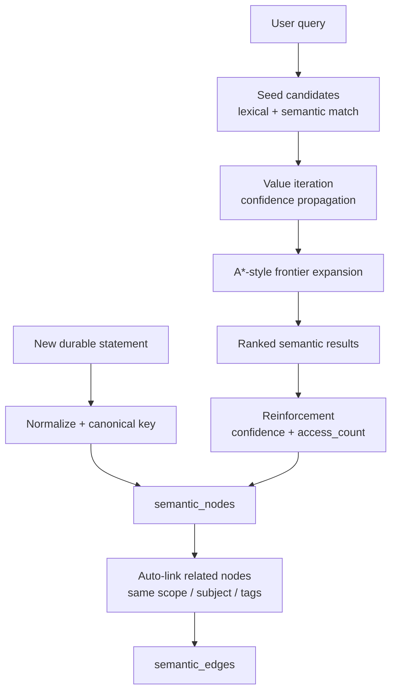

# Clark Semantic Memory

Standalone semantic memory built around your **CLARK** idea, kept fully separate from [`jessica-knowledge-graph`](https://github.com/altyshalu/jessica-knowledge-graph).

This project is for **durable knowledge**, not raw chat history.

It stores stable truths about:

- projects
- tools
- rules
- operating context

Examples:

- `A Zone prepares startups before investor matching`
- `Hermes is the runtime behind Jessica`
- `Never overwrite user-owned files without approval`

## Why this exists

Ordinary memory systems mix everything together:

- session chatter
- extracted facts
- temporary plans
- durable operating rules

That creates noisy recall.

Clark Semantic Memory is narrower on purpose:

- it only stores knowledge worth keeping across sessions
- it links memories into a small semantic graph
- it reinforces useful memories over time
- it retrieves by meaning plus graph structure, not just exact keywords

## CLARK Retrieval Loop

The retrieval flow is Clark-shaped:

1. **Seed**
   Find candidate memories using lexical overlap and deterministic semantic similarity.
2. **Propagate**
   Run value iteration over the semantic graph so confidence spreads through connected nodes.
3. **Expand**
   Use an A*-style frontier to walk outward from strong seeds into relevant neighbors.
4. **Reinforce**
   Increase confidence and access count for memories that were actually retrieved.

## Architecture



## Data Model

Everything lives in one local SQLite database:

- `semantic_nodes`
  durable memories with `canonical_key`, `kind`, `scope`, `subject`, `statement`, `confidence`
- `semantic_edges`
  links between related memories with weighted relations
- `retrieval_events`
  audit trail of what was retrieved for which query

## What gets stored

The system is designed for four kinds of durable context:

### Project knowledge

- project mission
- architecture
- product boundaries
- important business context

### Tool knowledge

- what runtime is used
- what system is authoritative
- where data lives
- what tool does what

### Rules

- safety rules
- workflow rules
- operator constraints
- formatting conventions

### Stable operating context

- long-lived team practices
- repeated environment assumptions
- recurring platform constraints

## What does *not* belong here

Do **not** use this memory for:

- transient brainstorm notes
- one-off chat messages
- raw transcripts
- temporary todos
- rapidly changing execution state

That should live somewhere else, like episodic memory or task state.

## Quick Start

```bash
cd /Users/altynaiakylbekova/Downloads/clark-semantic-memory
uv venv .venv
uv pip install --python .venv/bin/python -e .
```

## CLI

### Store durable knowledge

```bash
.venv/bin/clark-memory remember-project "a-zone" "A Zone prepares startups before investor matching." --key "project:a-zone:mission"
.venv/bin/clark-memory remember-tool "Hermes" "Hermes is the runtime behind Jessica." --key "tool:hermes:runtime"
.venv/bin/clark-memory remember-rule "file-safety" "Never overwrite user-owned files without approval." --key "rule:file-safety"
```

### Query semantic memory

```bash
.venv/bin/clark-memory query "What runtime powers Jessica?"
```

### Print session-ready semantic context

```bash
.venv/bin/clark-memory context
```

### List stored entries

```bash
.venv/bin/clark-memory list
.venv/bin/clark-memory list --kind tool
```

## Python API

```python
from clark_semantic_memory import ClarkSemanticMemory

memory = ClarkSemanticMemory()

memory.remember_project(
    "A Zone prepares startups before investor matching.",
    project="a-zone",
    canonical_key="project:a-zone:mission",
)

memory.remember_tool(
    "Hermes is the runtime behind Jessica.",
    tool_name="Hermes",
    canonical_key="tool:hermes:runtime",
)

memory.remember_rule(
    "Never overwrite user-owned files without approval.",
    rule_name="file-safety",
    canonical_key="rule:file-safety",
)

result = memory.query("What runtime powers Jessica?")
print(result["results"][0]["statement"])

print(memory.session_context())
memory.close()
```

## Retrieval Behavior

Each result comes back with:

- `canonical_key`
- `kind`
- `scope`
- `subject`
- `statement`
- `confidence`
- `cosine_sim`
- `propagated_confidence`
- `score`

This makes it easy to:

- inspect why something ranked high
- debug graph effects
- feed the result into another agent or orchestrator

## Example Output

```json
{
  "query": "What runtime powers Jessica?",
  "results": [
    {
      "canonical_key": "tool:hermes:runtime",
      "kind": "tool",
      "subject": "Hermes",
      "statement": "Hermes is the runtime behind Jessica.",
      "score": 0.6932,
      "layer": "semantic"
    }
  ],
  "count": 1
}
```

## Tests

```bash
cd /Users/altynaiakylbekova/Downloads/clark-semantic-memory
.venv/bin/python -m unittest test_clark_memory.py
```

## Current Properties

- fully local
- SQLite-based
- deterministic embeddings by default
- no cloud dependency required
- explicit canonical keys for stable upserts
- separate from your bigger memory repo

## Good Next Steps

- connect this to Jessica/Hermes as a dedicated semantic backend
- add import/export from Telegram summaries or operator notes
- add scoped namespaces per project or team
- add richer relation typing for stronger propagation
